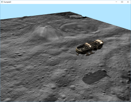
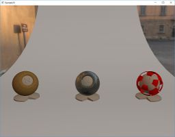


Vulkan examples using VulKan ToolS (VKTS):
------------------------------------------

First steps using VKTS:  
[Steps](VKTS_Documentation/FirstSteps.md)

Building for Android, Linux and Windows:  
[Build](VKTS_Documentation/Build.md)

Example assets:  
[Assets](VKTS_Documentation/Assets.md)

Execute and debug:  
[Execute](VKTS_Documentation/Execute.md)

Features of VulKan ToolS (VKTS):  
[VKTS](VKTS_Documentation/VKTS.md)

Architecture of VKTS:  
[Architecture](VKTS_Documentation/Architecture.md)

Gamepad, keyboard and mouse input:  
[Input](VKTS_Documentation/Input.md)

Exporter for the scene file format:  
[Exporter](VKTS_Documentation/Exporter.md)

Used headers and pre-build libraries:  
[External libraries](VKTS_Documentation/External.md)

Used tools, applications and libraries:  
[Tools](VKTS_Documentation/Tools.md)

Used licenses:  
[Licenses](VKTS_Documentation/Licenses.md)


Vulkan examples based on VKTS:
------------------------------

[VKTS_Example01](VKTS_Example01) - Initializing Vulkan and clearing the background.  
  
      
This example brings up a simple window and clears the content every frame. No shaders, buffers or graphics pipelines are used.    
      
[VKTS_Example02](VKTS_Example02) - Rendering of a red triangle.  
  
      
This example renders a red triangle by passing NDC coordiantes. This example utilizes shaders, vertex buffers and a graphics pipeline.    
      
[VKTS_Example03](VKTS_Example03) - Rendering of a full screen texture.  
  
      
This example renders a a full screen texture. Main topic of this example is on how to use staging buffers in Vulkan.    
      
[VKTS_Example04](VKTS_Example04) - Loading and rendering of an animated, mip mapped textured cube.  
  
      
This example loads and renders an animated, textured cube modeled in Blender. The crate texture does have several mip levels.    
      
[VKTS_Example05](VKTS_Example05) - Phong rendering of a tree and an animated plane with several animations.  
  
      
This example loads another scene modeled in Blender. This scene has a node tree, having several animations.    
      
[VKTS_Example06](VKTS_Example06) - Skeletal animation plus camera movement depending on gamepad input.  
  
      
This example loads and renders a skeletal animated character modeled in Blender. Also, the scene can be cotrolled with a gamepad.    
      
[VKTS_Example07](VKTS_Example07) - Multi-threaded terrain rendering using normal and displacement mapping.
      
The terrain scene has 64 patches, which are processed in parallel by several threads. Only if a patch is visible by the camera, it is added to the secondary command buffers. After all patches are processed, the primary command buffer is drawing the terrain by executing the above secondary command buffers.    
    
  
  
  
[VKTS_Example08](VKTS_Example08) - Calculating and drawing of the Mandelbrot set using the core Vulkan API.
      
This example uses only the core Vulkan API, so no extensions are activated. A compute shader is calculating the Mandelbrot set and is storing the values into an offscreen image. As soon as the compute shader is done, the final image is saved as a TGA image to the file system.      
    

  
  
[VKTS_Example09](VKTS_Example09) - Shadow mapping, blending and MSAA.
      
This example renders into an offscreen framebuffer, writing only the depth value as the shadow map. In the following command, this depth texture is used to generate shadows. The spaceship does have transparent elements, so first the opaque and then the transparent elements are drawed. This content is also rendered into an offscreen multisample framebuffer, which is finally resolved to the visible window.   
    

  
  
[VKTS_Example10](VKTS_Example10) - Deferred real-time physically based rendering (PBR).
      
This example uses the exported Cycles materials from Blender to render the diffuse and specular shader into an offscreen G-Buffer. The environment is pre-filtered and stored in several textures and cube maps. This allows to do image based lighting and to resolve the PBR materials in real-time. This example uses no anti-aliasing, which could be either done in a post process or using a multi-sample G-Buffer.  
    

  
  
VKTS test programs:
-------------------

VKTS_Test_General - VKTS internal test program, to verify general functions.

VKTS_Test_Input   - VKTS internal test program, to verify input functions.
  
  
VKTS presentations:
-------------------

[Khronos Munich Chapter Meeting 04/08/2015](VKTS_Documentation/presentations/Khronos_Chapter_VKTS.pdf) - "VulKan ToolS - Filling the gap between driver and application."


