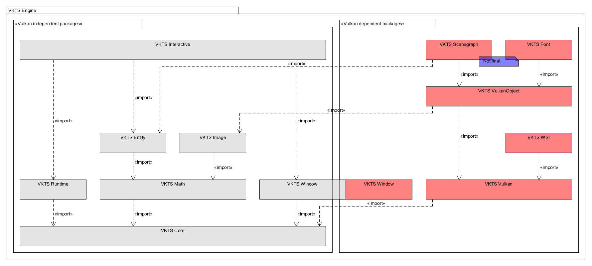

Architecture and API design:
----------------------------

The following picture shows the VKTS architecture and the dependencies of the packages: 

Block diagram of VKTS packages  

API design:
-----------

Almost all classes do have an interface class and do have to be created by a factory method and/or class.
The classes are grouped into packages, which do depend on each other. A strict bottom down dependency is kept.
The packages are clustered by non-graphics and graphics API functionality.
Finally, only the bottom layer packages are platform dependent and provide an platform independent interface.     

One reason for this design is to easily exchange packages. If e.g. [GLFW](http://www.glfw.org/) has to be used
instead of the internal windowing system, implementing the interface for just this package is needed.

Another reason for several packages is to use just the packages required for an application. This also allows
to use the packages in other frameworks e.g. using the scengraph package to load the scengraph but render the content with the own API.

All the VKTS packages depend on the Vulkan header but not on the Vulkan library. This allows to use all Vulkan independent packages
without Vulkan. Furthermore, if the interfaces of the Vulkan dependent packages are implemented for another graphics API e.g. OpenGL
can be used for rendering.    

The main reason for the factory functions is to have no "invalid" objects:
The factory function makes sure, that the object is properly created and if a Vulkan object is used, correctly initialized. If for any
reason the factory method fails, an empty smart pointer is returned. Result is, that there are no objects, which e.g. the class constructer
succeeded but the internal state is invalid because a Vulkan function failed for some reason. 

Also, most objects can not implicitly copied. If an object can be copied, there is a clone method available. This avoids, that by a simple
copy accidently a lot of code is executed.
Of course, simple classes e.g. for math can just be created and copied. 
